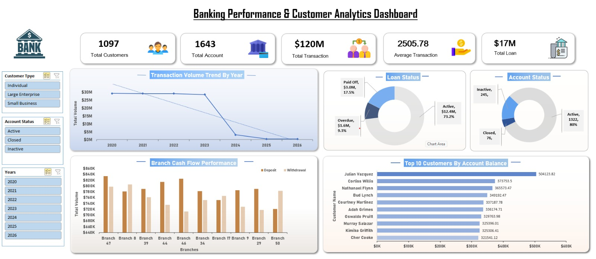

# 🏦 Banking Performance & Customer Analytics Dashboard

## 📌 Project Overview
This project analyzes banking operations, customer activity, account performance, transaction behavior, and loan portfolios to provide actionable insights for improving customer engagement, financial performance, and risk monitoring.

This project leverages Excel and PostgreSQL to analyze banking operations and build an interactive dashboard that provides insights into customer behavior, transaction trends, loan performance, and branch-level financial activity.


## 🎯 Purpose & Business Problem
Banks generate large volumes of transactional and customer data. Monitoring customer activity, account performance, branch efficiency, and loan exposure manually is difficult and time-consuming.
A centralized dashboard is required to track key banking metrics and support data-driven decision-making.
### Objectives
* Monitor overall banking performance.
* Track customer transaction behavior
* Evaluate account activity
* Analyze branch performance
* Identify high-value customers
* Detect inactive customers

## 🛠️ Tech Stack
* **Excel:**  data cleaning, formatting, XLOOKUP merges,Power Query,Power Pivot, Pivot Table and Dashboard Development.
* **PostgreSQL:** Structural database staging,Business Analysis, table joins, Common Table Expressions (CTEs), and advanced window function queries.

## 📂 Dataset Information
* **Source:** Kaggle (Finance, Fraud, and Loans Dataset)
* **Link:** [Finance, Fraud, and Loans Dataset](https://www.kaggle.com/datasets/testdatabox/finance-fraud-and-loans-dataset-testdatabox)
* **Description:** Relational database sheets containing transactional logs, customer profiles, account types, loan performance metrics, and branch tracking records.

---

## 🔄 Project Workflow

### 1. Data Cleaning & Transformation (Excel & Power Query)
*  Addressed and removed raw row duplication to safeguard ledger integrity. Handled missing or null records systematically without dropping necessary transaction footprints.
*  Standardized formatting across tables and Reviewed non-sequential IDs.
*  Used `XLOOKUP` to enrich datasets across multiple tables.
*  Applied Power Query transformations for data shaping and standardization

### 2. Database Staging & Refinement (PostgreSQL)
*  Standardized systemic country-level syntax errors and textual spelling mistakes within the localized tables.
*  Configured relational joins and view dependencies (`v_transactions`, `v_accounts`) to run transactional audit scripts.
*  Perform Analysis on: Banking Performance,  Total Loan Exposure, Net Cash Flow, Monthly Transaction Value trands.

### 4.Dashboard (Excel)
* Built relationship using Power Pivot
* Structured underlying metrics using explicit Pivot calculations to power dynamic interactive charts, dynamic slicers, and core business KPIs.
* Build KPIs, Added interactive features And analysis performance.


---

## 📊 Business Questions & SQL Analysis

Here are the key operational queries developed within PostgreSQL to guide the business logic:

1. What is the monthly transaction volume and value trends.
<details>
<summary><b>Query And Result</b></summary>

<br>

## 📝 SQL Code

```sql
SELECT 
    DATE_TRUNC('month', transaction_date)::DATE AS months,
    COUNT(transaction_id) AS transaction_volume,
    SUM(amount) AS transaction_value
FROM v_transactions
WHERE transaction_date IS NOT NULL
GROUP BY months
ORDER BY months;
```

## 📊 Query Output

| Month | Transaction Volume | Transaction Value |
|:------|-------------------:|------------------:|
| 2020-01-01 | 952 | 2,386,945.22 |
| 2020-02-01 | 960 | 2,444,240.82 |
| 2020-03-01 | 954 | 2,367,498.37 |
| 2020-04-01 | 977 | 2,476,271.24 |
| 2020-05-01 | 1,031 | 2,619,028.02 |
| 2020-06-01 | 989 | 2,490,105.51 |
| 2020-07-01 | 953 | 2,354,323.54 |
| 2020-08-01 | 993 | 2,469,798.22 |
| 2020-09-01 | 977 | 2,389,217.24 |
| 2020-10-01 | 941 | 2,344,223.49 |

</details>

2.    Calculate average transaction amount by account type
<details>
<summary><b>Query And Result</b></summary>

<br>

## 📝 SQL Code

```sql
SELECT 
    at.account_type_name,
    SUM(t.amount) AS total_rev,
    ROUND(AVG(t.amount), 2) AS avg_transaction_amount
FROM account_types AS at
JOIN accounts AS a 
    ON at.account_type_id = a.account_type_id
JOIN transactions AS t 
    ON a.account_id = t.account_origin_id
GROUP BY at.account_type_name
ORDER BY total_rev DESC;
```

## 📊 Query Output

| Account Type | Total Revenue | Average Transaction Amount |
|:-------------|--------------:|---------------------------:|
| Business | 27,376,760.75 | 2,513.70 |
| Youth | 24,887,249.17 | 2,505.01 |
| Savings | 24,614,318.65 | 2,507.83 |
| Checking | 23,218,113.12 | 2,511.42 |
| Payroll | 22,686,141.14 | 2,487.24 |

</details>

3. Identify customers with no transactions in the last 90 days.
<details>
<summary><b>Query And Result</b></summary>

<br>

## 📝 SQL Code

```sql
WITH last_transactions AS (
    SELECT 
        a.customer_id,
        MAX(transaction_date)::DATE AS last_transaction
    FROM v_accounts AS a
    JOIN v_transactions AS t 
        ON a.account_id = t.account_origin_id
    WHERE transaction_date IS NOT NULL
    GROUP BY a.customer_id
)

SELECT 
    c.customer_id,
    CONCAT(c.first_name, ' ', c.last_name) AS full_name,
    CURRENT_DATE - last_transaction AS days_since_last_transaction
FROM v_customers AS c
JOIN last_transactions AS lt 
    ON c.customer_id = lt.customer_id
ORDER BY days_since_last_transaction DESC;
```

## 📊 Query Output

| Customer ID | Customer Name | Days Since Last Transaction |
|------------:|:--------------|----------------------------:|
| 10951 | Albert Gay | 1,125 |
| 10434 | Raymundo Castaneda | 1,093 |
| 10337 | Jamar Brooks | 1,083 |
| 10182 | Hobert Howell | 1,082 |
| 10633 | Augustus Patrick | 1,063 |
| 10474 | Don Bird | 1,049 |
| 10967 | Alonzo Miller | 1,037 |
| 10239 | Sean Pope | 1,033 |
| 10889 | Shane Daniels | 1,031 |
| 10044 | Jeanmarie Fulton | 1,023 |

</details>

4. Identify customers with more than one active loan and measure their total exposure.
<details>
<summary><b>Query And Result</b></summary>

<br>

## 📝 SQL Code

```sql
SELECT
    c.customer_id,
    CONCAT(c.first_name, ' ', c.last_name) AS customer_name,
    COUNT(l.loan_id) AS active_loan_count,
    ROUND(SUM(l.principal_amount), 2) AS total_exposure
FROM customers AS c
JOIN accounts AS a
    ON c.customer_id = a.customer_id
JOIN loans AS l
    ON a.account_id = l.account_id
JOIN loan_statuses AS ls
    ON l.loan_status_id = ls.loan_status_id
WHERE ls.status_name = 'Active'
GROUP BY
    c.customer_id,
    customer_name
HAVING COUNT(l.loan_id) > 1
ORDER BY total_exposure DESC;
```

## 📊 Query Output

| Customer ID | Customer Name | Active Loan Count | Total Exposure |
|------------:|:--------------|------------------:|----------------:|
| 10800 | Minh Horne | 4 | 258,667.73 |
| 10113 | Gaynelle McKee | 3 | 246,713.05 |
| 10062 | Milton Powell | 2 | 176,444.58 |
| 10209 | Eleni Joyner | 2 | 161,978.91 |
| 10503 | Simon Nicholson | 2 | 158,957.32 |
| 10431 | Brady Irwin | 2 | 157,446.53 |
| 10224 | Murray Salazar | 2 | 157,127.07 |
| 10458 | Julian Vazquez | 3 | 150,145.75 |
| 10705 | Rozanne Bradford | 2 | 149,840.59 |
| 10407 | Harold Pope | 2 | 146,020.58 |

</details>


## 📈 Key Findings

* **Portfolio  Overview:** The institution manages **$120M** in total transaction value across a portfolio of **1,097** customers, balancing an active loan book of **$17M**.
* **Account Operational:** Out of **1,643** total opened customer accounts, **80% (1,322)** remain fully active, providing a stable core deposit framework for lending allocations.
* **Credit Risk Exposure Analysis:** Loan distribution audits reveal that **73.2% ($12.4M)** of outstanding loan values sit within standard active performance thresholds, while **9.3% ($1.6M)** are flagged as overdue, requiring proactive risk mitigation.
* **Branch Capital Inflows:** branch-level cash flow visualization highlights specific branches that lead deposit generation, indicating prime locations for high-net-worth services.

## 💡 Business Impact & Insights

* Improved visibility into customer behavior, transaction activity, and branch performance through a centralized dashboard.
* Enabled data-driven decision-making by providing actionable insights across customers, accounts, transactions, and loans.
* **Loan Exposure Control:** Identifying a specific segment of high-risk borrowers holding multiple active concurrent loans allows the credit risk team to implement stricter debt-to-income caps.
* **Optimizing Branch Capital Allocation:** The distinct financial variances highlighted by branch-level cash flow visualizations allow leadership to optimize physical footprint strategies. High-performing deposit nodes can be prioritized for premium wealth-management services, while branches with net cash outflows can look toward operational restructuring.
* **Targeted Customer Retention & Wealth Management:** Isolating the small tier of core enterprise and high-net-worth individual clients who hold the vast majority of total ledger balances allows for the creation of dedicated VIP retention pipelines. Safeguarding these accounts stabilizes the bank's deposit base used for lending.
* ** At-Risk Account Management:** Utilizing the dormancy auditing pipeline to target accounts with zero transactional touchpoints over a trailing 90-day window enables automated win-back marketing campaigns. Re-engaging these customers early prevents complete account closure and customer churn.

  ## Dashboard Screenshots




